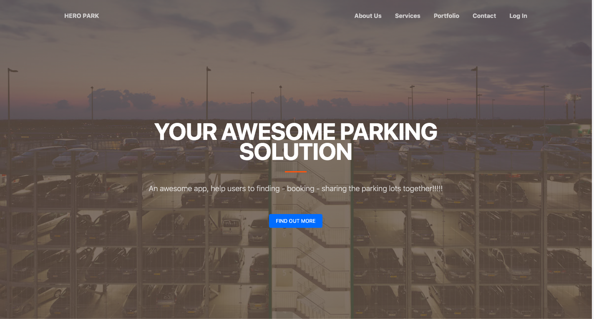
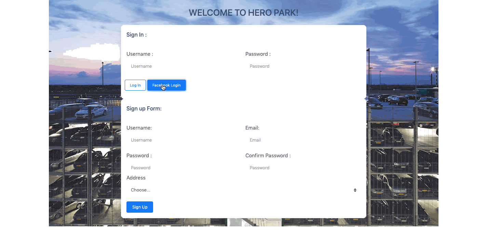

<h1 align="center" style="border-bottom: none !important; margin-bottom: 5px !important;"><a href="https://hero-park.netlify.com/">Hero Parking!</a></h1>

  
  

An awesome app, help users to finding - booking - sharing the parking lots together!!!!!

 Create with ReactJS for front-end and Python for back-end!

  
  

 

 

 

### Project Main Structure

- **Landing- Page**: Basic information of the project ( includes : contact, imgs, introduce...)
- **Sign in - Sign up**: Handle Sign-in and sign-up account!
- **Hero Park Dashboard**:After sign in success, user can access to the dashboard, where user can:
### With normal user
- Finding nearly building with user location, with directly information that which building avalable parking lot or not.
- Booking the available parking lot with correct information about price, location of the parking lot to keep the lot.
- After booking, user allow 15 minutes to keep the booking, and not be charge any fee for this booking , user allow to reverse all booking that they already booked on this time without money charge.
- After 15 minutes, if user decide to click "check-in" , they will have a transaction and ticket to check-in with the building parking lot, and they will be charge at this time.
- User can see the current booking lot and the time they check-in.
- After finish using the parking lot, user can click to the button "Check-out" to finish the booking, transcation will give back the price that user must pay, and the parking lot will return to "Available" for other users.
     

### With Buidling owner
- Can create the building for other user can see and book the "Available" lots.
- Can easy to create | edit | delete the parking lot information.
- Can see the transaction of their building.
     

